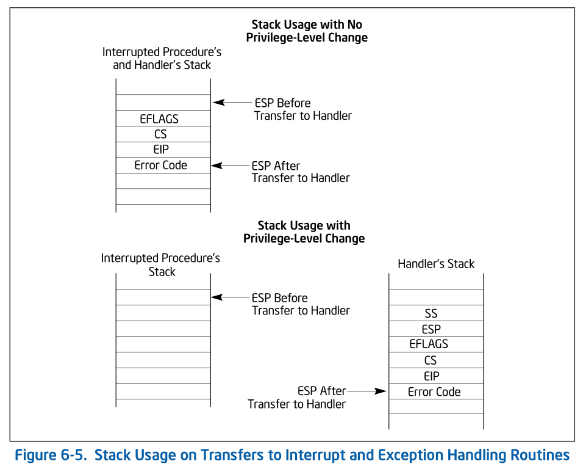
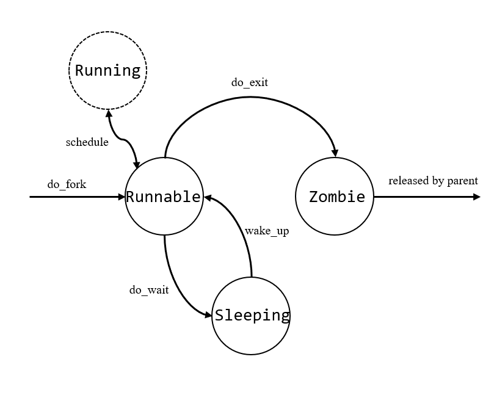

### 目录

1. x86 中断/异常处理 (tss 和 tf 作用)
2. 重要函数说明
    1. 创建进程 (线程)
    2. 调度，运行
    3. do_wait & do_exit
    4. do_execve
    5. 其它系统调用
3. FAQ
    1. 一个进程被创建后如何开始执行？
    2. 一个用户进程如果因为时间片用完而被调度掉后，再次被调度回来时会从哪里继续执行？
    3. 一个进程的完整生命周期？
    4. fork 调用，为什么父进程返回值为 pid，子进程返回值为 0（**涉及到用户进程的创建**）

### 总结

实验 3 涉及到的知识点：

1. x86 中断中 tss 的作用（类似的内核栈，中断帧的概念）
2. 进程如何创建、执行、切换（do_fork, do_wait, do_exit 等系统调用的设计与实现）
3. 用户进程的创建、执行过程
4. 用户 ulib 库 fork, wait, exit 的实现

<!-- more -->

### x86 中断/异常处理 (tss 和 tf 作用)

*p.s. 见 x86 manual Vol. 1 6-11*

If the code segment for the handler procedure has the same privilege level as the currently executing program or task, the handler procedure uses the current stack; if the handler executes at a more privileged level, the processor switches to the stack for the handler’s privilege level.

**Call**

If no stack switch occurs, the processor does the following when calling an interrupt or exception handler (see Figure 6-5):

1. Pushes the current contents of the **EFLAGS**, CS, and **EIP** registers (in that order) on the stack.
2. Pushes an **error code** (if appropriate) on the stack.
3. Loads the segment selector for the new code segment and the new instruction pointer (from the interrupt gate or trap gate) into the CS and EIP registers, respectively.
4. If the call is through an interrupt gate, clears the **IF flag** in the EFLAGS register.
5. Begins execution of the handler procedure.

If a stack switch does occur, the processor does the following:

1. Temporarily saves (internally) the current contents of the SS, ESP, EFLAGS, CS, and EIP registers.
2. Loads the segment selector and stack pointer for the new stack (that is, the stack for the privilege level being called) **from the TSS into the SS and ESP registers** and switches to the new stack.
3. Pushes the temporarily saved SS, ESP, EFLAGS, CS, and EIP values for the interrupted procedure’s stack onto the new stack.
4. Pushes an error code on the new stack (if appropriate).
5. Loads the segment selector for the new code segment and the new instruction pointer (from the interrupt gate or trap gate) into the CS and EIP registers, respectively.
6. If the call is through an interrupt gate, clears the IF flag in the EFLAGS register.
7. Begins execution of the handler procedure at the new privilege level.

**return**

A return from an interrupt or exception handler is initiated with the IRET instruction. The IRET instruction is similar to the far RET instruction, except that it also restores the contents of the EFLAGS register for the interrupted proce-dure.

When executing a return from an interrupt or exception handler from the same privilege level as the inter-rupted procedure, the processor performs these actions:

1. Restores the CS and EIP registers to their values prior to the interrupt or exception.
2. Restores the EFLAGS register.
3. Increments the stack pointer appropriately.
4. Resumes execution of the interrupted procedure.

When executing a return from an interrupt or exception handler from a different privilege level than the interrupted procedure, the processor performs these actions:

1. Performs a privilege check.
2. Restores the CS and EIP registers to their values prior to the interrupt or exception.
3. Restores the EFLAGS register.
4. Restores the SS and ESP registers to their values prior to the interrupt or exception, resulting in a stack switch back to the stack of the interrupted procedure.
5. Resumes execution of the interrupted procedure.



总结：

发生中断，无特权级转换时，使用原本的栈来存储中断帧。发生特权级转换时（好像只有用户态到内核态），使用当前进程 tss 中的 ss0, esp0 所指向的栈（内核栈）来存储中断帧，且 cpu 会在中断帧中额外存储当前的 ss 和 esp。（*p.s. cpu 通过比较中断向量指向的中断描述符和 cs 寄存器来检测是否存在特权级的转换。而执行 iret 时，cpu 通过比较栈中的 cs 和 cs 寄存器来检测是否需要特权级的转换*）

### 重要函数说明

#### 创建进程 (线程)

1. kernel_thread

   ```c
   int kernel_thread(int (*fn)(void *), void *arg, uint32_t clone_flags)
   ```

   作用：创建一个内核线程，该线程将执行 fn 函数，参数为 arg，clone_flags 控制是否共享父进程内存，返回线程 pid。

   实现：

   1. 设置 tf

      ```c
      tf.tf_regs.reg_ebx = (uint32_t)fn;
      tf.tf_regs.reg_edx = (uint32_t)arg;
      tf.tf_eip = (uint32_t)kernel_thread_entry;
      ```

      其中 kernel_thread_entry 如下：

      ```asm
      kernel_thread_entry:        # void kernel_thread(void)
      
          pushl %edx              # push arg
          call *%ebx              # call fn
      
          pushl %eax              # save the return value of fn(arg)
          call do_exit            # call do_exit to terminate current thread
      ```

      说明：

      1. 中断帧中的 eip 被设置为了 kernel_thread_entry，**如果让 cpu 根据该中断帧返回，cpu 便会回到 kernel_thread_entry**，然后由于通用寄存器 ebx, edx 也已经恢复成 fn, arg 的值，因而可以成功调用 fn 函数。

      2. 后面 do_fork 中的 copy_thread 函数会将进程 context 中的 eip 设为 forkret，而 forkret 便会让进程从中断帧返回

      3. 当进程结束时会调用 do_exit

   2. 调用 do_fork

      ```c
      do_fork(clone_flags | CLONE_VM, 0, &tf);
      ```

2. do_fork

   ```c
   /* do_fork -     parent process for a new child process
    * @clone_flags: used to guide how to clone the child process
    * @stack:       the parent's user stack pointer. if stack==0, It means to fork a kernel thread.
    * @tf:          the trapframe info, which will be copied to child process's proc->tf
    */
   int
   do_fork(uint32_t clone_flags, uintptr_t stack, struct trapframe *tf)
   ```

   作用：从父进程产生一个子进程（通过 clone_flags 来控制是否共享内存）

   说明：目前只用于实现 kernel_thread 函数，如果要让用户进程通过 do_fork 来产生子进程，应该需要再封装一个类似于 kernel_thread 的函数，其中 tf.eip 的设置就不会用 kernel_thread_entry 了。

   实现：

   ```c
       //    1. call alloc_proc to allocate a proc_struct
       //    2. call setup_kstack to allocate a kernel stack for child process (8KB)
       //    3. call copy_mm to dup OR share mm according clone_flag
       //    4. call copy_thread to setup tf & context in proc_struct
       //    5. insert proc_struct into hash_list && proc_list
       //    6. call wakeup_proc to make the new child process RUNNABLE
    //    7. set ret vaule using child proc's pid
   ```

   1. alloc_proc, 分配一个 pcb 结构体

   2. setup_kstack, 分配内核栈空间 (8KB)

   3. copy_mm, 复制页表/共享页表

      ```c
      static int
      copy_mm(uint32_t clone_flags, struct proc_struct *proc) 
      ```

      `clone_flags & CLONE_VM`为真时，proc 的 mm 设置为 current->mm，即和当前进程共享内存。

      *p.s. vma 一致，因此进程有效的虚拟内存空间一致。页表一致，因此访问同一份物理地址*

      否则，复制当前进程的虚拟内存 (vma)，复制物理内存并设置对应的页表。（复制了当前进程的内存）

      实现：

      copy_mm

      -> dup_mmap, 调用 copy_range 复制每一个 vma

      -> copy_range, 复制一段虚拟地址对应的物理内存，并设置页表

   4. copy_thread, 设置 tf, context

      中断帧位于内核栈顶部

      ```c
      proc->tf = (struct trapframe *)(proc->kstack + KSTACKSIZE) - 1;
      ```

      设置线程 context 的初始状态，eip 设置为 forkret

      ```c
      proc->context.eip = (uintptr_t)forkret;
      proc->context.esp = (uintptr_t)(proc->tf); #更新栈顶位置
      ```

   5. get_pid, 设置进程 pid

      hash_proc, 将进程添加到哈希表 hash_list

      set_links, 将进程添加到进程双向链表 proc_list，并将进程设置为其父进程最小的子进程 cptr

   6. wakeup_proc, 将进程设置为 runnable

#### 调度，运行

1. schedule

   ```c
   void schedule(void)
   ```

   作用：

   按照 FIFO 的策略，从进程链表中选择一个进程执行。如果没有找到的话，执行 idle 进程。

2. proc_run

    ```c
    void
    proc_run(struct proc_struct *proc)
    ```

    作用：

    开始运行一个进程

    实现：

    ```c
    current = proc; //设置 proc 为当前进程
    
    //kstack+KSTACKSIZE 为进程内核栈栈顶，设置 ts 中的 esp0，当中断且存在特权级转换时，使用进程的内核栈。
    load_esp0(next->kstack + KSTACKSIZE); 
    
    //切换页目录表。因为内核代码位于 0-4M 以内，而所有进程的页表都存在该段地址的映射，因此切换后，后面的代码都是能正常执行的
    lcr3(next->cr3);
    
    switch_to(&(prev->context), &(next->context));
    ```

3. switch_to

   ```asm
   switch_to:                      # switch_to(from, to)
   
       # save from's registers
       movl 4(%esp), %eax          # eax points to from
       popl 0(%eax)                # save eip !popl
       movl %esp, 4(%eax)
       movl %ebx, 8(%eax)
       movl %ecx, 12(%eax)
       movl %edx, 16(%eax)
       movl %esi, 20(%eax)
       movl %edi, 24(%eax)
       movl %ebp, 28(%eax)
   
       # restore to's registers
       movl 4(%esp), %eax          # not 8(%esp): popped return address already
                                   # eax now points to to
       movl 28(%eax), %ebp
       movl 24(%eax), %edi
       movl 20(%eax), %esi
       movl 16(%eax), %edx
       movl 12(%eax), %ecx
       movl 8(%eax), %ebx
       movl 4(%eax), %esp
   
       pushl 0(%eax)               # push eip
   
       ret
   ```

   作用：

   保存当前上下文到切换前进程 (from) 的 context 中，并恢复切换后进程 (to) 的 context

#### do_wait & do_exit

1. do_exit

   ```c
   // do_exit - called by sys_exit
   //   1. call exit_mmap & put_pgdir & mm_destroy to free the almost all memory space of process
   //   2. set process' state as PROC_ZOMBIE, then call wakeup_proc(parent) to ask parent reclaim itself.
   //   3. call scheduler to switch to other process
   int do_exit(int error_code)
   ```

   作用：

   释放进程内存空间，将进程设置为 ZOMBIE 状态，并唤醒父线程（设置为 RUNNABLE），然后调用调度器。

   关键代码：

   ```c
   lcr3(boot_cr3);
   if (mm_count_dec(mm) == 0) {
       exit_mmap(mm); //是 copy_mm 的逆过程，释放了物理内存和页表
       put_pgdir(mm); //释放页目录表
       mm_destroy(mm); //释放 vma
   }
   current->mm = NULL;
   ```

   如果该进程有子进程，则还需要将子进程设置为 init 进程的子进程。

2. do_wait

   ```c
   // do_wait - wait one OR any children with PROC_ZOMBIE state, and free memory space of kernel stack
   //         - proc struct of this child.
   // NOTE: only after do_wait function, all resources of the child proces are free.
   int
   do_wait(int pid, int *code_store)
   ```

   作用：

   等待一个或任意一个子进程执行 do_exit 变为 Zombie 状态，然后释放子进程的结构体

#### do_execve

1. do_execve

   ```c
   // do_execve - call exit_mmap(mm)&put_pgdir(mm) to reclaim memory space of current process
   //           - call load_icode to setup new memory space accroding binary prog.
   int
   do_execve(const char *name, size_t len, unsigned char *binary, size_t size)
   ```

   作用：

   根据二进制程序，为当前进程设置新的内存空间

   注意点：

   1. 在 lab3 中，user_main 进程是通过 kernel_thread 创建的，所以刚开始是一个内核进程。但通过 sys_execve 系统调用后，新的内存空间

2. load_icode

   作用：

   将 ELF 文件读到内存，并为当前进程重新设置内存空间 (mm 虚拟内存，页表)。

   **并修改了当前进程的 tf 为：cs 为用户段，esp 使用用户栈，eip 为 elf->entry**

   ```c
   tf->tf_cs = USER_CS;
   tf->tf_ds = tf->tf_es = tf->tf_ss = USER_DS;
   tf->tf_esp = USTACKTOP;
   tf->tf_eip = elf->e_entry;
   tf->tf_eflags = FL_IF;
   ```

#### 其它系统调用

1. do_yeild

   进行一次进程调度（通过设置 need_reschedule）

2. do_kill

   将进程 Flag 设置为 PF_EXITING，当 switch_to 到该进程后会触发 do_exit(KILLED)

### FAQ

1. 一个进程被创建后如何开始执行？

   答：

   1. 通过 kernel_thread 创建的内核进程。kernel_thread 调用 do_fork（分配内核栈，内存空间）后，进程状态为 Runnable，当被调度器调度到时 (schedule)，会通过 proc_run -> switch_to 进行上下文切换，而由于进程的初始上下文 (context) 的 eip 被设置为了 forkret，于是会从 forkret 开始执行，forkret 会执行中断返回的代码，iret 到 kernel_thread_entry 处开始执行，从而执行进程的函数代码。
   2. 用户进程参考 FAQ#4
   3. 进程调用 do_execve 后会重新分配内存空间，重新设置 tf(eip 为 elf->entry)，重新开始执行。

2. 一个用户进程如果因为时间片用完而被调度掉后，再次被调度回来时会从哪里继续执行？

   当 CPU 遇到中断后，会进入异常处理程序，（vector.S -> __all_traps -> trap() -> trap_dispatch() -> 异常处理 -> 返回到 trap_ret -> 中断返回），ucore 对于时钟中断的处理是将当前的进程设置为 need_resched，从而在 trap() 中会调用 schedule()。

   中断时，进程的“用户态上下文”被存入中断帧中（该进程的内核栈栈顶；其中一部分由硬件完成如 cs, eip, eflag，其它如通用寄存器则由软件完成）。而之后在内核态进行的一系列函数调用也是使用该进程的内核栈。在执行 schedule 后，通过软件将该进程的“内核态上下文”存入该进程数据结构的 context 变量中（eip 为 switch_to() 调用的下一条指令）。因此再次切换回来时，仍处于内核态，并从 switch_to() 下一条继续执行，经过一系列函数返回，最终回到 trap_ret，从进程的中断帧返回到用户态，也就是该进程时钟中断之前的状态。

3. 一个进程的完整生命周期？

   ```c
   // process's state in his life cycle
   enum proc_state {
       PROC_UNINIT = 0,  // uninitialized
       PROC_SLEEPING,    // sleeping
       PROC_RUNNABLE,    // runnable(maybe running)
       PROC_ZOMBIE,      // almost dead, and wait parent proc to reclaim his resource
   };
   ```

   

4. fork 调用，为什么父进程返回值为 pid，子进程返回值为 0（**涉及到用户进程的创建**）

   ```
   cprintf("I am the parent. Forking the child...\n");
   if ((pid = fork()) == 0) {
    cprintf("I am the child.\n");
   }
   ```

   答：

   父进程执行路线：

   1. fork() -> /user/libs/syscall::sys_fork()

      int SYS_fork 引起中断，**保存中断帧**（父进程的内核栈中）

   2. __all_traps -> trap -> trap_dispatch -> syscall -> **do_fork**

      ​ do fork**参数为父进程的中断帧**

   3. 从 do_fork 返回到 syscall

      syscall 中代码：

       ```
       tf->tf_regs.reg_eax = syscalls[num](arg);
       ```

       将父进程的中断帧的 eax 修改为 do_fork 返回的 pid

   4. 返回到__all_traps -> trapret

      从中断帧返回，继续执行fork()后代码

   子进程执行路线：

   1. schedule -> proc_run - > switch_to -> fork_ret

      从中断帧返回，执行 fork() 后的代码

   可以看到，父进程更改了 eax，故返回值变为 pid，子进程则为原始的 eax（这里我还不太清楚为什么一定为 0）
