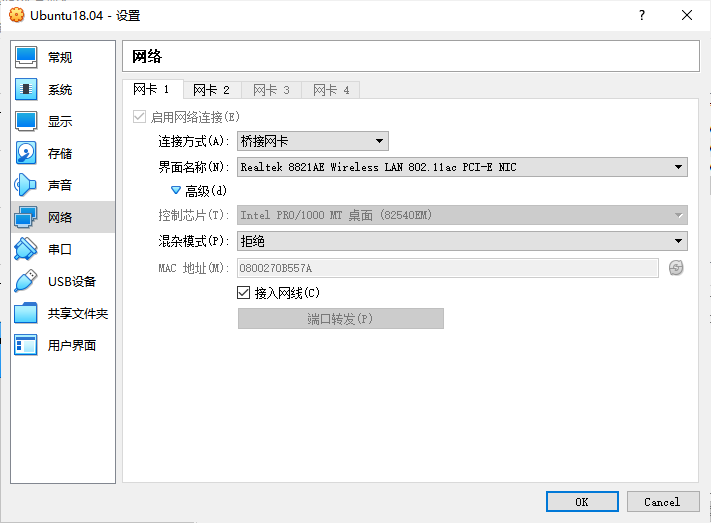
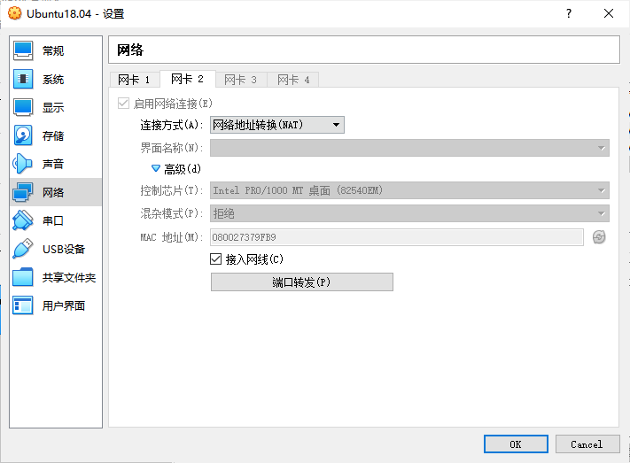
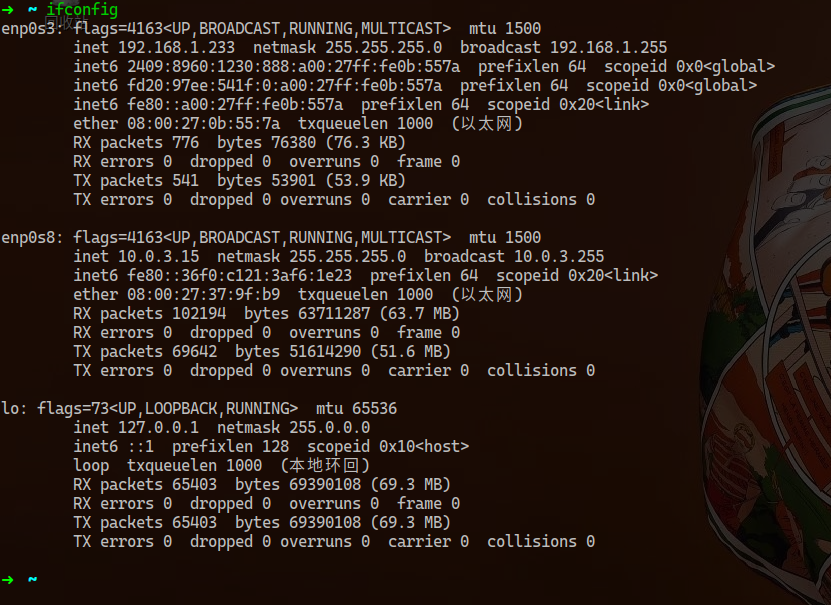
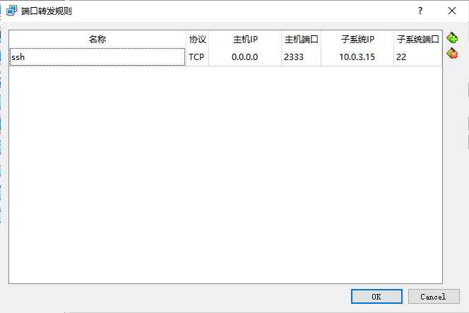

由于目前在电脑上运行一个虚拟机已经比较流畅，而虚拟机又有着真机无法比拟的优势，如：

- 可以快速地进行备份与还原，且备份的虚拟机镜像可以复制到其它电脑上
- 可以保存虚拟机当前的运行状态（快速休眠），而下次启动时恢复运行（且速度很快）

因此我配置了一台 Ubuntu18.0 的虚拟机，并做了以下配置：

- 配置了 build-essential, python3, git, vim 等常用软件
- 配置了 zsh，以及一些 zsh 的插件如自动提示，命令高亮，auto-jump
- 配置了 VS Code, Chromium 软件
- 配置了 nodejs, cnpm, hexo 等，用于编写 hexo 博客
- 启动 sshd，并配置网络

其中，关于最后一点。刚开始我采用了桥接网络 + 静态 ip 的方案。但是发现当主机网络环境改变时，ssh 便连接不上了，于是便有了这篇博客。

<!-- more -->

### 基本知识

虚拟机配置网络有三种方式：

1. NAT
2. 桥接模式
3. Host-Only

采用 NAT 方式时，虚拟机和主机位于不同的网段，主机会运行 NAT 程序，虚拟机通过主机访问外网。因此和主机位于同一个局域网络的其它主机无法直接访问虚拟机（不在同一网段），若要访问，则需要在主机上设置端口转发。

采用桥接模式时，虚拟机和主机位于相同的网段，可以直接访问外网。且和主机位于同一局域网的其它主机可以直接访问虚拟机。但如果主机切换了网络，则虚拟机的 ip 也会发生变化。

Host-Only 和 NAT 模式类似，只是主机不设置端口转发，因此更加安全。

### 解决方法

为了同时拥有 NAT 模式和桥接模式的优点，可以为虚拟机设置两张网卡。

在 VB 中设置虚拟机的网络（需要虚拟机关机）





ifconfig 查看网卡设置



其中 enp0s3 为桥接网卡，enp0s8 为 NAT 网卡

配置网卡 2 的端口转发



其中虚拟机 ip 为 10.0.3.15，sshd 开启的端口为 22

于是便可以通过主机的 2333 端口 ssh 连接到虚拟机了

```bash
ssh user@127.0.0.1 -p 2333
```

### ssh 登录

为了在登录时不用输入密码，可以使用 ssh-key 登录

1. 在主机上生成 ssh key

    ```bash
    ssh-keygen
    ```

    会在~/.ssh 下生成公钥和私钥`id_rsa.pub, id_rsa`

2. 将公钥复制到虚拟机的`~/.ssh/authorized_keys`中，或使用`ssh-copy-id`命令

    ```bash
    ➜  ~ ssh-copy-id -h              
    Usage: /usr/bin/ssh-copy-id [-h|-?|-f|-n] [-i [identity_file]] [-p port] [[-o <ssh -o options>] ...] [user@]hostname
     -f: force mode -- copy keys without trying to check if they are already installed
     -n: dry run    -- no keys are actually copied
     -h|-?: print this help
    ```

    此时再 ssh 已经不用输入密码了

3. VS Code 的 Remote-SSH 扩展
    使用 VS Code 的 Remote-SSH 连接到虚拟机，可以避免直接在虚拟机上运行 VS Code 卡慢的问题。
    且 VS Code 提供的图形化目录也更加直观，并且可以将主机上的文件直接拖拽进虚拟机

    配置主机上的~/.ssh/config（通过扩展可以直接选择）

    ```
    Host VM-Ubuntu18.0
      HostName 127.0.0.1
      Port 2333
      User rain
      IdentityFile ~/.ssh/id_rsa
    ```

    这样一来，VS Code Remote Explorer 便会显示远程的虚拟机（也可以通过`ssh rain@VM-Ubuntu18.0`命令行进行 ssh 连接）

### 关于配置静态 ip

ubuntu 采用 netplan 配置网络

```bash
➜  ~ cat /etc/netplan/01-network-manager-all.yaml                     
# Let NetworkManager manage all devices on this system
network:
  version: 2
  renderer: NetworkManager
  ethernets:
    enp0s3:
      dhcp4: false
      addresses:
      - 192.168.1.233/24
      gateway4: 192.168.1.1
      nameservers:
              addresses: [223.5.5.5, 223.6.6.6]
```
