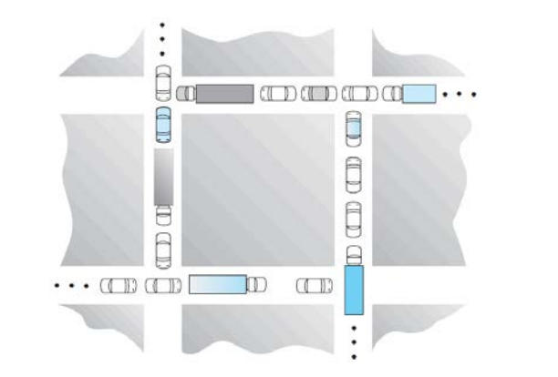

# 操作系统第7章 作业 死锁
---

## 1、 
Consider the traffic deadlock depicted in follow figure.

 

a. Show that the four necessary conditions for deadlock indeed hold in this example.
b. State a simple rule for avoiding deadlocks in this system.

- a.
    1. mutual exclusion: 每条道路都只能让一个方向的车通行，且车之间不可能**穿透而过**。
    2. hold and wait: 四个方向的车辆都占有一条道路，并等待另一方向的车露出空隙。
    3. no preemption: 每个方向的车都必须等待另一个方向的车主动倒车，无法强迫。
    4. circular wait： 每个方向的车互相等待，形成一个环。
- b. 安排一位交警选择并指挥一个方向的车让出道路。

## 2、
Consider a system consisting of four resources of the same type that are shared by three processes, each of which needs at most two resources. Show that the system is deadlock free.

答：反证法，假设形成了死锁。则由每个进程最多需求2个资源实例，和死锁必要条件中的3，4点可知，唯一的情形是：三个进程各自占有一个资源且等待另一个资源，并形成了一个环。而在该情况下，剩余的一个资源导致死锁不会发生。

## 3、 
Consider a system consisting of m resources of the same type being shared by n processes. Resources can be requested and released by processes only one at a time. Show that the system is deadlock free if the following two conditions hold:

- a. The maximum need of each process is between 1 and m resources.
- b. The sum of all maximum needs is less than m + n.

$ a.\ \sum_{i=1}^n Max_i < m+n $
$ b.\ Max_i \geq 1\ for\ all\ i $
$ c.\ Need_i = Max_i − Allocation_i $

If there exists a deadlock state then:
$ d.\ \sum_{i=1}^n Allocation_i = m $

$ a,b,c,d\ \Rightarrow \sum_{i=1}^n Need_i < n $

This implies that there exists a process $ P_i $ such that $ Need_i = 0 $. Since $ Max_i >= 1 $, it follows that $ P_i $ has at least one resource, the deadlock can't maintain. 

## 4、  
Consider the following snapshot of a system:

| PID | AL. |   |   |   | MAX |   |   |   |
| --- | --- | - | - | - | --  | - | - | - |
|     | A   | B | C | D | A   | B | C | D |
| P0  | 0   | 0 | 1 | 2 | 0   | 0 | 1 | 2 |
| P1  | 1   | 0 | 0 | 0 | 1   | 7 | 5 | 0 |
| P2  | 1   | 3 | 5 | 4 | 2   | 3 | 5 | 6 |
| P3  | 0   | 6 | 3 | 2 | 0   | 6 | 5 | 2 |
| P4  | 0   | 0 | 1 | 4 | 0   | 6 | 5 | 6 |

| AV. |   |   |   |
| --- | - | - | - |
| A   | B | C | D |
| 1   | 5 | 2 | 0 |

*(p.s. AL.= Allocated:, AV.= Available)*

Answer the following questions using the banker's algorithm:
a. What is the content of the matrix Need?
b. Is the system in a safe state?
c. If a request from process $ P_1 $ arrives for (0,4,2,0), can the request be granted immediately?

- a
    | PID | need |   |   |   |
    | --- | --- | - | - | - |
    |     | A   | B | C | D |
    | P0  | 0   | 0 | 0 | 0 |
    | P1  | 0   | 7 | 5 | 0 |
    | P2  | 1   | 0 | 0 | 2 |
    | P3  | 0   | 0 | 2 | 0 |
    | P4  | 0   | 6 | 4 | 2 |
- b 由银行家算法可知是安全的，序列$<0,2,1,3,4>$为安全序列。
- c 假设满足，则$ Need_{P_1} =(0,11,7,0) $，序列$ <0,2,3,4,1> $为安全序列，故可立即满足。

## 5、 
Consider a system with four processes$ P_1,\ P_2,\ P_3$ and $ P_4 $, and two resources, $ R_1,\ R_2 $ respectively. Each resource has two instances. Furthermore:

$ P_1 $ allocates an instance of $ R_2 $  , and requests an instance of $ R_1 $ ;
$ P_2 $  allocates an instance of $ R_1 $ , and doesn’t need any other resource;
$ P_3 $  allocates an instance of $ R_1 $ and requires an instance of $ R_2 $ ;
$ P_4 $  allocates an instance of $ R_2 $ , and doesn’t need any other resource.
Answer the following questions:

a. Draw the resource allocation graph.
b. Is there a cycle in the graph? If yes name it. 
c. Is the system in deadlock? If yes, explain why. If not, give a possible sequence of executions after which every process completes.

- a. 略
- b. 存在
- c. 不是，$ <P_1, P_4, P_2, P_3,> $ 