我姐的电脑是 15-16 年买的，型号为 Acer Aspire V15 Nitro Black Edition(暗影骑士 2，精确型号为 Aspire VN7-592G-58NG)，[ZOL](http://detail.zol.com.cn/notebook/index1102903.shtml)上的商品信息

不得不说这台电脑确实是非常厉害了，有以下这些亮眼的地方。

- i5-6300HQ。HQ 表示标压 - 四核。
- NIVIDIA 的 GTX960M 独立显卡。（当时的中端主流显卡）

下面这些即使是现在也是完全够用的，特别是那个支持 2x2 MU-MIMO 的无线网卡。

- Realtek 8168/8111 **千兆**以太网卡。
- Qualcommm Atheros NFA344A 无线网卡。（**支持 2x2 MU-MIMO**，Wifi4, Wifi5）<https://oemdrivers.com/network-qualcomm-atheros-qca61x4a-wireless>
- 1 个 USB 2.0， **2 个**USB 3.0，1 个**Thunderbolt 3**接口。s

而不仅限于此，这台电脑的扩展性是真的非常不错。

- 2 条内存条插槽。支持最大 32G（原装了一条海力士的 4GB DDR4 2133MHz 内存条）
- 一个 m.2 插槽，**支持 NVMe 协议**（PCIe Gen3x4，最高 4GB/s）。

下面是发现这台电脑支持 NVMe 协议的固态的曲折过程：

在阅读之前，需要以下知识：

- m.2 接口（也叫 NGFF(Next Generation Form Factor)）
- NVMe

<!-- more -->

在拆机后发现电脑有 m.2 接口，如图：

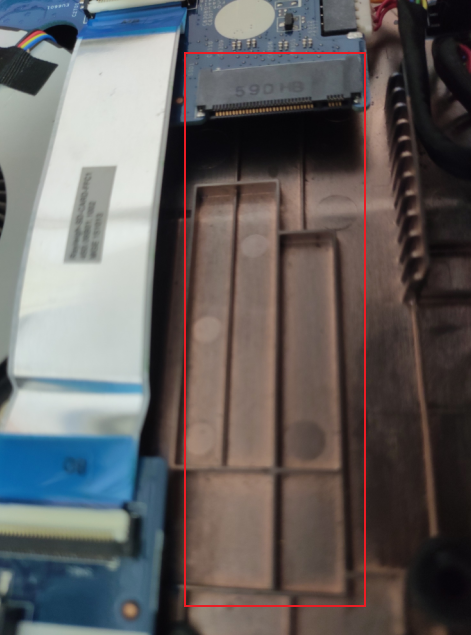

此时，天真的以为有 m.2 接口就是要买 NVMe 的固态硬盘。在经过搜索后才知道 m.2 接口的也有 SATA 版本的固态硬盘。然后就面临着如何去确认自己电脑的 m.2 接口是否支持 NVMe 协议的问题。（因为 NVMe 的快非常多）

此时直接去搜索“如何确认自己电脑是否支持 NVMe”这个问题，可能会得到这些答案（其它答案参考性不是很大）

- m.2 接口分为 B key 和 M key 的形状（缺口在左边和缺口在右边）。B key 的走的是 SATA 通道，不支持。M key 的可能支持，看主板上 m.2 接口旁边是否有 PCIe 的标识。
- 看 BIOS 是否有 NVMe 相关的选项。

但是遗憾的是，BIOS 中我没有看到相关设置，也没看到 PCIe 的标识。

在进行上一步的同时，我也去 Acer 支持网站](<https://www.acer.com.cn/support.html?type=1>) 搜索了产品信息。

这里可以找到驱动的文件，不过看不到产品的详细信息。

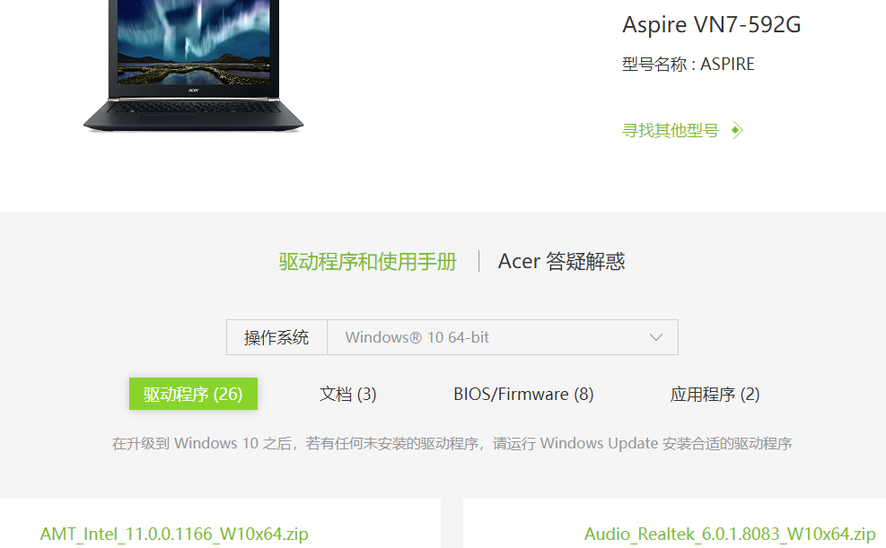

然后偶然发现，在香港的这个[网站](https://www.acer.com/ac/zh/HK/content/support)是可以看到设备参数的

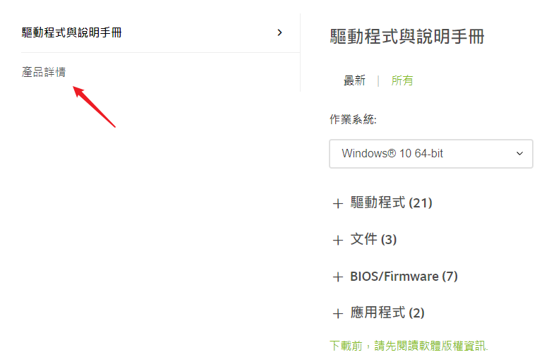

在这里面确实可以看到很多信息，如内存的插槽数量

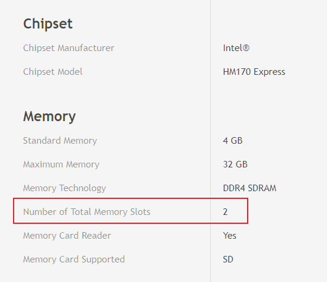

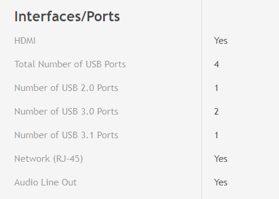

但是还是找不到关于那个 m.2 插槽的信息。

此时我都比较倾向于认为这个 m.2 插槽不支持 NVMe 了，这时又找到了一篇知乎的[回答](https://www.zhihu.com/question/301112945)。

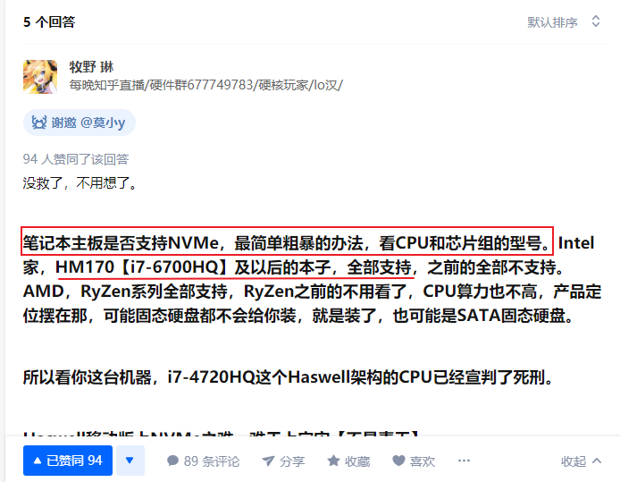

我马上去看了下电脑的芯片组型号。在官网上找到的参数已经表明了芯片组为 intel HM170 Express。虽然上面的知乎回答写了 HM170 支持，但是保险起见还是去搜索一下。直接搜索芯片型号，可以找到 intel 官网的[信息](https://www.intel.cn/content/www/cn/zh/products/chipsets/mobile-chipsets/hm170.html)。

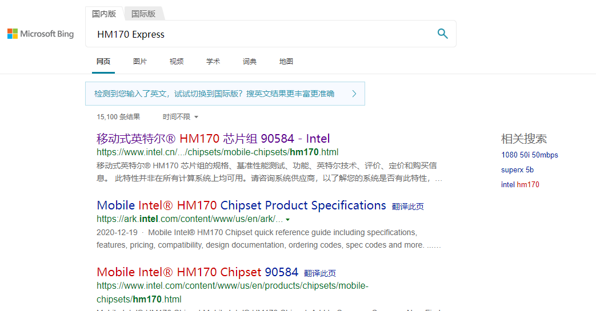

虽然其规格参数里提到了很多 PCIe，但是此时我对芯片组的概念以及作用不是很了解，不太清楚其和固态硬盘的关系。所以还是不是很确定。

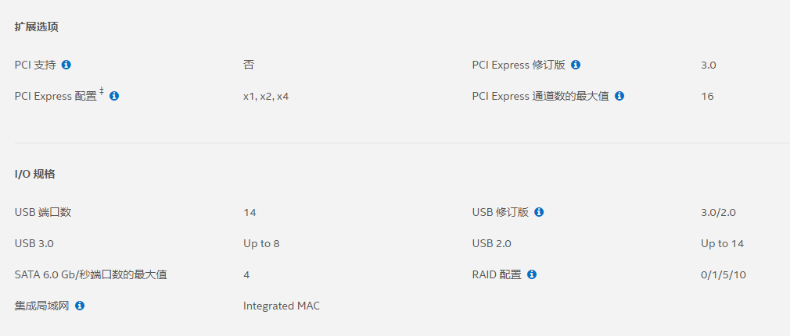最后在下面的相关材料中找到了一个更详细的文档

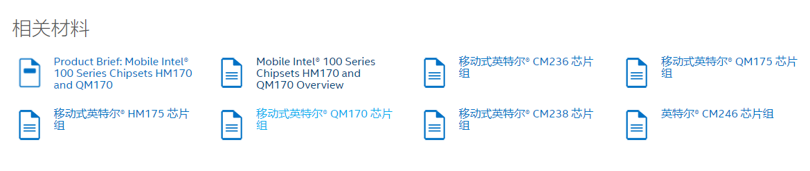

其中赫然写着支持 NVMe 的固态硬盘。

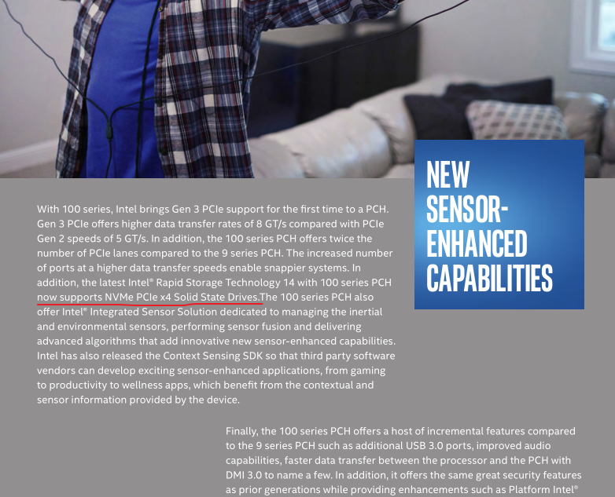

此时悬着的心落下了一半，但是还是有疑问（此时我对芯片组 (chipset) 还有主板 (motherboard) 之间的关系不是很清楚）：主板是 Acer 制造的，而芯片组是 intel 生产的。会不会出现虽然芯片支持 PCIe x4 的 NVMe 的固态，但是主板把这个功能阉割掉了呢？

此时我觉得还是去搜索一下别人对这台电脑的评测比较好。这次我直接试着用 google 搜索以下关键字（之前搜索拆机方法的时候，中文找不到太多信息）：

*"Does Apsire VN7-592G support NVMe SSD"*

好家伙。。。

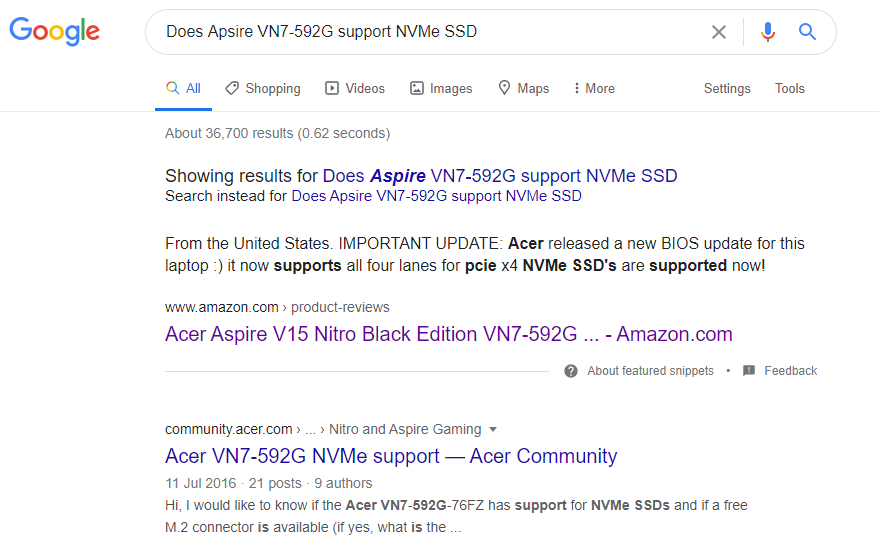

点击进去，就看到这么直接的答案。。。

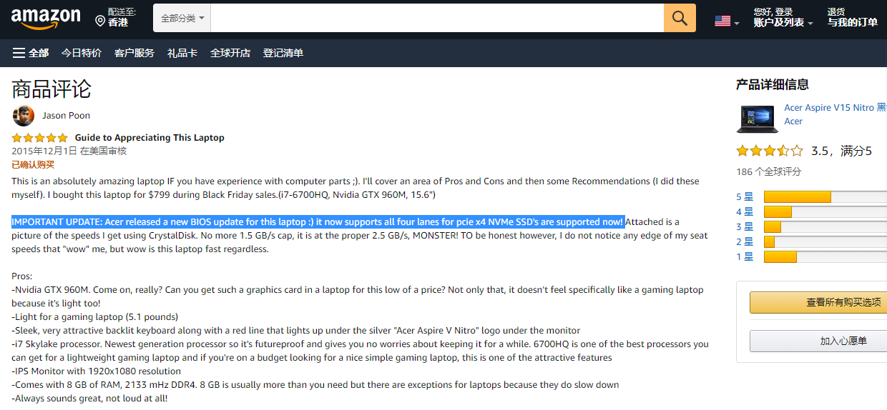

以上就是我确定这台电脑能否装 NVMe 固态的及其曲折的过程。结果原来只需要 google 一下。。。(试了一下，中文是搜索不到的)

后续：

陆续搜索又发现

- BIOS 有 bug

  <https://community.acer.com/en/discussion/443066/acer-vn7-592g-nvme-support>

  这里确认了电脑的 m.2 接口支持 NVMe，且 m.2 的规格是 80mm x 22mm

  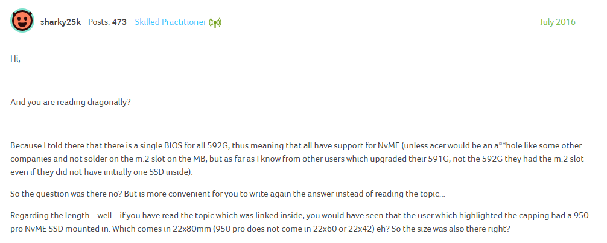

  这里提到有 Bug，且该帖子后面也没有官方解决

  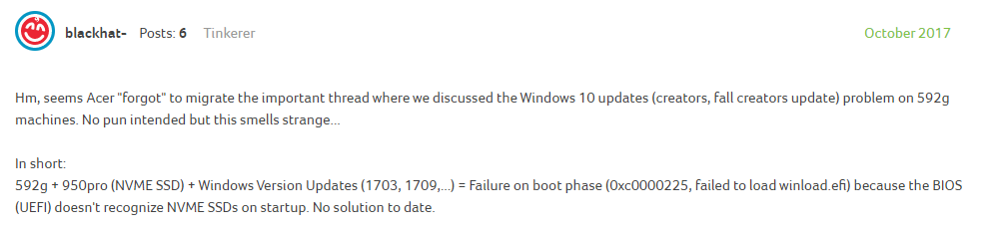

  <https://community.acer.com/en/discussion/551094/acer-aspire-v-nitro-592g-ssd-m-2-or-nvme>

  这里还是提到有 bug

  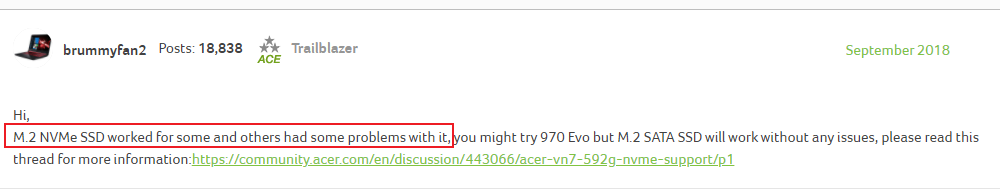

- 台湾的一个关于升级 NVMe SSD 的帖子

  <https://www.mobile01.com/topicdetail.php?f=232&t=4728385>

  他这里提到支持 NVMe 的两个条件

  1. 主板的 m.2 接口有实质的 PCIe 线路

     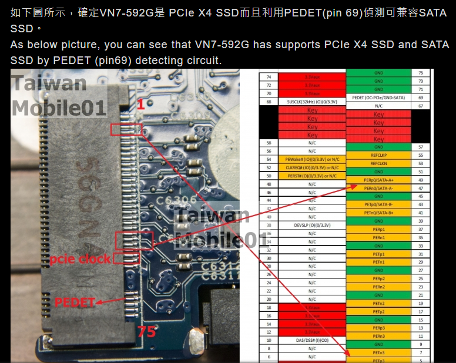

     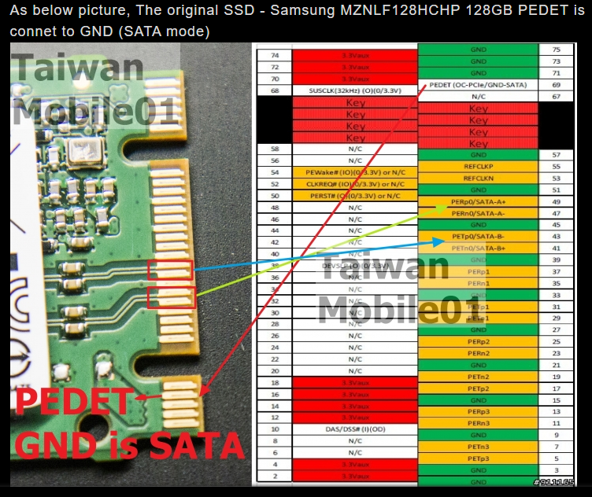

  2. 第二点 BIOS 要支持

     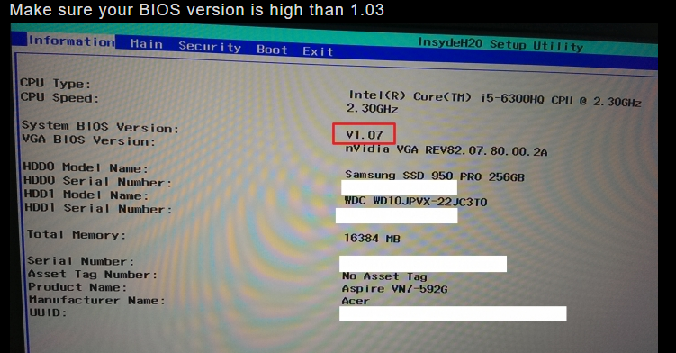

- 关于 m.2 的 slot 是否支持 SATA

  1. SATA 的 SSD 有 B key 和 M+B key 两种，NVMe 的 SSD 只有 M key 一种
  2. m.2 m key 既支持 NVMe，又支持 SATA（大部分）

- 总结 m.2, SATA, PCIe, AHCI, NVMe 的自我理解（可能会有错误，更新中）
  1. m.2、SATA 和 PCIe 是一种接口，这里的接口指的是两个组件的连接部分。
  2. SATA 和 PCIe 也是一种总线，这里指的是数据和控制信号传输的通路。
  3. AHCI 和 NVMe 是 protocal，这里还不是很清楚，这个是属于操作系统里的驱动吗？
  4. 机械硬盘采用 SATA 接口 +AHCI 协议。
  5. 早期的固态为了兼容也使用 SATA 接口，因此也使用 AHCI 协议，最高速度为 600MB/s（SATA3）
  6. 由于 AHCI 是为机械硬盘设计的协议，不能充分发挥 SSD 的速度。于是之后引入了新的协议——NVMe，同时采用了 PCIe 或者 m.2 的接口，可以达到更高的速度。如 3500MB/s
