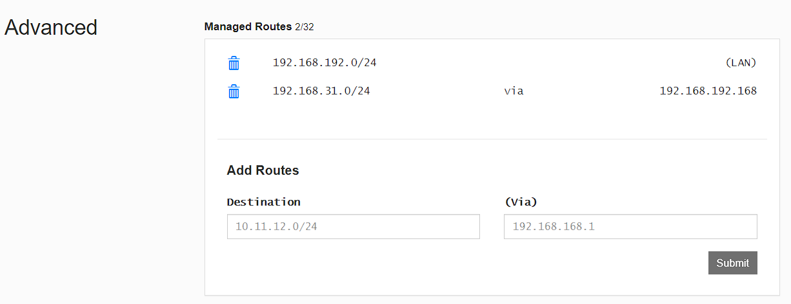

- 移动宽带开启 ipv6
- Openwrt 安装 ZeroTier
- Openwrt 配置 ipv6
- CPU 性能测试

<!-- more -->
## 移动宽带开启 ipv6

1. 移动光猫使用桥接模式 + 路由器使用拨号上网
2. 移动光猫开启 ipv6 步骤

   1. 删除原本 ipv4 的 PPPoE
   2. 协议选择 ipv4/ipv6，创建新的**PPP**连接

## Openwrt 安装 ZeroTier

### 作用

1. 将若干个安装了 Zerotier 的设备添加到一个大局域网中互相访问
2. 在 Zerotier 中设置 Route，从而实现访问 openwrt 设备局域网中的其它设备

### 相关教程

1. [openwrt 官方 19.07.3 固件使用 zerotier 的配置过程 - OPENWRT 专版 - 恩山无线论坛 - Powered by Discuz! (right.com.cn)](https://www.right.com.cn/FORUM/thread-4042849-1-1.html)

2. <https://www.bilibili.com/video/BV1hT4y1E78k>

### 具体过程

0. 去 ZeroTier 注册一个账号，并了解 ZeroTier 的使用

1. 安装 zerotier

   ```
   opkg update
   opkg install zerotier
   ```

   这里会依赖 kmod-tun 等内核模块，这要求内核版本完全一致才能安装成功。openwrt 开发版本 (snapshot) 每天、甚至几个小时就会更新，因此很有可能因为有了新的更新，导致 opkg 下载的 kmod-tun 内核版本不一致导致报错。解决办法为更新为新版的开发版，并尽快下载安装。对于 stable 版本，官方源保证了一致性，因此这里不会出现问题。

2. 配置 ZeroTier

   ```
   mkdir -p /etc/zerotier
   uci set zerotier.openwrt_network=zerotier
   uci add_list zerotier.openwrt_network.join='你的网络 ID'
   uci set zerotier.openwrt_network.enabled='1'
   uci set zerotier.openwrt_network.config_path='/etc/zerotier'
   uci commit zerotier
   ```

3. 启动 zerotier（此时已经可以从 ZeroTier Central 中看到路由器连上了）

   ```
   /etc/init.d/zerotier enable
   /etc/init.d/zerotier start
   ```

4. 创建接口

   web 界面，网络 -> 接口，添加新接口
   名称 ZeroTier
   协议选静态协议，ip 设置为 ZeroTier Central 中的 ip
   接口选 z 开头的适配器
   创建/分配防火墙区域选择 lan
   保存&应用

5. 防火墙

   全部设置成 allow

   

8. **ZeroTier Central 配置路由转发**

   配置这个后，在外网可以通过局域网 ip 直接访问不在 ZeroTier Central 中的其它局域网设备。（过程大致是：外网 -> zerotier -> 局域网一台设备 (位于 ZeroTier 中) -> 局域网其它设备）

   **注意**：别将第一行的删了，否则全部无法访问

   **缺点**：目前发现，当两台电脑位于同一个局域网，想要直接通过局域网 ip 访问时，即使没有开启 zerotier 软件，两台电脑的相互访问速度也会严重受限（原本可以跑到 500M，直接降为 10M）

   配置图：访问 192.168.31.*中的设备时，会通过 192.168.192.168(实际局域网 ip 为路由器) 访问



## Openwrt 配置 ipv6

### 说明

安装好 openwrt(21.02) 后，会默认开启并配置 ipv6，电脑可以直接访问 ipv6。但是该方式只有路由器能得到一个公网 ipv6 地址，路由器局域网内设备只有本地 ipv6 地址。类似于 Openwrt 开启了一层 ipv6 的 NAT。而为了让连上路由器的所有设备获得公网 ipv6 地址，需要进行以下设置

### 理论

<https://www.bilibili.com/video/BV1Lb4y197wD>

<https://www.bilibili.com/video/BV15K4y1W74Q>

- RA(router advertisement)：路由器通告，通过广播该信息，给设备分配 ipv6 地址
- SLAAC(Stateless Address Autoconfiguration)：无状态的地址自动配置协议。使用 RA 进行地址配置，特点是无状态的。DHCPv6 则是有状态的。目前会混合使用这两个协议来配置 ipv6。

### 配置

可以通过 luci 来配置，也可以直接修改/etc/config/dhcp 文件来配置

修改 dhcp 涉及 ipv6 部分为以下配置即可（其中 wan6 部分可能需要自己添加）

```
config dhcp 'lan'
        option interface 'lan'
        option start '100'
        option limit '150'
        option leasetime '12h'
        option dhcpv4 'server'
        option ra 'relay'
        option dhcpv6 'relay'
        option ndp 'relay'
        list ra_flags 'none'

config dhcp 'wan'
        option interface 'wan'
        option ignore '1'

config dhcp 'wan6'
        option interface 'wan'
        option ra 'relay'
        option dhcpv6 'relay'
        option ndp 'relay'
        option master '1'
```

## CPU 性能测试

### simple md5

[Router CPU performance - rm's homepage (romanrm.net)](https://romanrm.net/router-cpu-performance)

- mt7621
  - mi4a: 20MB/s
- a53
  - ax6s: 117.64MB/s
- rk3399: 200MB/s

### openssl

[[OpenWrt Wiki] OpenSSL benchmarks](https://openwrt.org/docs/guide-user/perf_and_log/benchmark.openssl)
rk3399

```
version: 3.0.2
built on: Wed May 24 17:12:55 2023 UTC
options: bn(64,64)
compiler: gcc -fPIC -pthread -Wa,--noexecstack -Wall -Wa,--noexecstack -g -O2 -ffile-prefix-map=/build/openssl-7eq86f/openssl-3.0.2=. -flto=auto -ffat-lto-objects -flto=auto -ffat-lto-objects -fstack-protector-strong -Wformat -Werror=format-security -DOPENSSL_TLS_SECURITY_LEVEL=2 -DOPENSSL_USE_NODELETE -DOPENSSL_PIC -DOPENSSL_BUILDING_OPENSSL -DNDEBUG -Wdate-time -D_FORTIFY_SOURCE=2
CPUINFO: OPENSSL_armcap=0xbf
The 'numbers' are in 1000s of bytes per second processed.
type             16 bytes     64 bytes    256 bytes   1024 bytes   8192 bytes  16384 bytes
md5              25117.29k    75388.93k   170339.41k   248440.15k   286692.69k   289434.28k
sha1             32326.83k   115190.76k   344452.95k   685736.96k   955422.04k   986294.95k
sha256           30650.33k   109581.03k   322119.25k   619945.64k   852036.27k   871251.97k
sha512           16066.74k    64347.97k   126085.80k   200046.93k   241947.99k   245028.18k
des-cbc              0.00         0.00         0.00         0.00         0.00         0.00
des-ede3         14249.92k    14731.20k    14853.12k    14884.86k    14893.06k    14893.06k
aes-128-cbc     404753.72k   850053.44k  1183380.39k  1294449.32k  1352469.16k  1352548.35k
aes-192-cbc     368863.90k   780227.81k  1056115.03k  1146200.75k  1192258.22k  1190625.28k
aes-256-cbc     359750.67k   697077.50k   883295.91k   988094.81k  1022683.82k  1021962.92k
                  sign    verify    sign/s verify/s
rsa 2048 bits 0.004963s 0.000132s    201.5   7580.0
                  sign    verify    sign/s verify/s
dsa 2048 bits 0.001820s 0.001724s    549.3    580.1
awk: not an option: -e
awk: not an option: -e
```

### coremark

coremark 是一个常用的测试 MCU 性能的跑分程序。在 openwrt 上安装了 gcc, make 后，可以在 openwrt 上编译并运行。
编译时注意：make NO_LIBRT=1

rk3399

```
2K performance run parameters for coremark.
CoreMark Size    : 666
Total ticks      : 20173
Total time (secs): 20.173000
Iterations/Sec   : 9914.241808
Iterations       : 200000
Compiler version : GCC11.3.0
Compiler flags   : -O2 -DPERFORMANCE_RUN=1  -lrt
Memory location  : Please put data memory location here
                        (e.g. code in flash, data on heap etc)
seedcrc          : 0xe9f5
[0]crclist       : 0xe714
[0]crcmatrix     : 0x1fd7
[0]crcstate      : 0x8e3a
[0]crcfinal      : 0x4983
Correct operation validated. See README.md for run and reporting rules.
CoreMark 1.0 : 9914.241808 / GCC11.3.0 -O2 -DPERFORMANCE_RUN=1  -lrt / Heap
```
