### 前言

起因是想在openwrt上装上**openclash**插件，但路由器空间不够了（路由器为mi4a千兆版，有一个16M的NOR flash。通过在编译时设置块大小为512KB，成功安装了`zerotier`,`wireguard`,`python`等软件，编译的镜像大小为13,894,754 B），因此参考官方教程：[[OpenWrt Wiki\] Saving firmware space and RAM](https://openwrt.org/docs/guide-user/additional-software/saving_space)，在编译时关闭了一些内核相关的选项，并将块大小设置为了1MB。最后成功生成镜像，大小为14,943,330 B。

可没想到在更新系统后路由器无法正确启动，于是需要先使用小米官方工具恢复，然后再重刷openwrt系统。但考虑到之后如果要多次尝试的话，每次失败都需要先恢复官方系统然后重新刷比较麻烦。于是这一次重装，我选择了刷**breed**引导程序。这样，下次刷失败后便可以通过breed直接重刷固件。

然而，不知是否是因为操作过程中的一个失误，我使用breed刷openwrt会失败，路由器会无限重启。并且在刷回官方固件后，甚至无法上网。最后，我从原厂固件直接刷回了openwrt，但是却发现openwrt中的**5GHz的无线最大发射功率(Maximum transmit power)居然变为了1mW(3dBm)**，这导致路由器的5G信号非常弱，即使是1m的距离，信号也很弱。于是我各种尝试去修复这个问题，以下是记录的过程。
<!--more-->

### 说明

可能需要了解mi4a的刷机过程，官方救砖工具

### 过程

#### 第一次尝试

在某次运行`OpenWRTInvasion`脚本时，切换了下网络，导致该次运行失败，可能导致从本地下载busybox-mipsel出错，从而导致了后来的错误。在后面的每一次通过官方工具重刷后，初始设置时的自动检测上网环境无法检测成功。并且，路由器网络出现问题，测速结果也很不正常。如图所示。

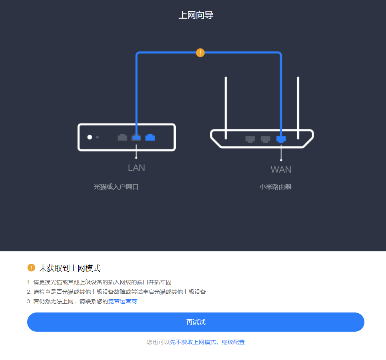

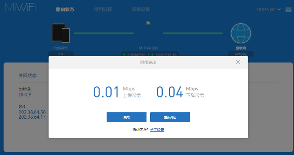

此时我在网上也搜索到EEPROM错误可能导致无线网络的问题。

> 注意：点击EEPROM后，浏览器会自动下载eeprom备份，默认文件名eeprom.bin，文件大小一般64K，这个文件中一般包含路由器MAC地址、无线校准参数等。丢失该文件，无线路由器可能WAN因为没有MAC无法从上级路由器获取IP；无线路由器没有无线信号或信号极弱。编程器固件就是闪存全部备份，相当于电脑硬盘的全盘镜像。[无线路由器刷机中，Breed详细使用教程，一些注意事项_备份 (sohu.com)](https://www.sohu.com/a/304140654_120096961)

幸好我第一次刷breed时，在breed中选择保存了EEPROM以及编程器固件。于是我进行了以下操作：

1. 使用breed恢复EEPROM后，同时刷入openwrt官方21.02版本initramfs-kernel.bin，结果没有无线网络。
2. 在openwrt中更新为官方21.02版本sysupgrade.bin后，变砖
3. 使用breed恢复官方bootloader，恢复官方固件，仍然有上面问题
4. 再次刷breed，恢复编程器固件full.bin
5. 刷openwrt sysupgrade.bin，反复重启（黄灯不亮）
6. 刷自己编译的squashfs-sysupgrade.bin，反复重启
7. 发现MAC地址发生了改变，恢复full.bin
8. 再次刷自己编译的squashfs-sysupgrade.bin，同时勾选EEPROM，反复重启
9. 刷了网上教程提供的标明为mir3g的固件（**这里可能导致后面的factory分区前移的问题**），可以启动，但是貌似没有网速。分区如下：（记住这里的factory offset为0x40000）
   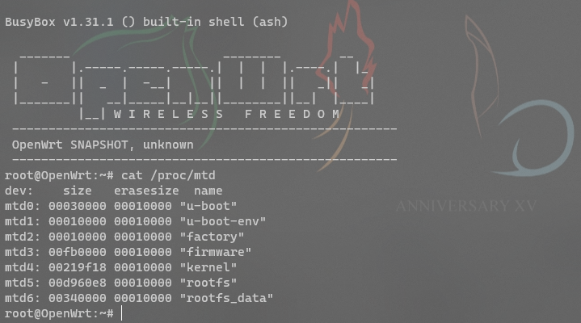

10. 最后还是不通过breed刷回了我的系统。需要注意的是：官方固件OS1分区为13M（但加上官方固件里多出的disk分区，大小为14.5M），而我自己编译的镜像超过了13M，因此直接刷会报错。于是我先刷官方镜像，再升级为我的镜像，成功。然而还是没有解决问题。

#### 第二次尝试

我还是认为是EEPROM丢失导致的问题，想到我之前保存了完整的flash内容，因此我考虑直接在openwrt中将flash内容dump下来，和之前保存的进行对比。

##### 理论

这次我仔细阅读了openwrt官方关于Flash Layout的文档（[[OpenWrt Wiki\] The OpenWrt Flash Layout](https://openwrt.org/docs/techref/flash.layout)），其中的内容非常丰富，介绍了：

- flash可能会因为[electromigration](https://en.wikipedia.org/wiki/electromigration),  [whisker growth](https://en.wikipedia.org/wiki/Whisker (metallurgy))而"磨损"。
- raw flash和FTL (Flash Translation Layer) flash的区别
  - 一个直接接入SoC（spi 控制器也算？），需要通过软件来处理坏块和磨损均衡
  - 而另一个则在flash上包含一个硬件模块，来处理坏块和磨损均衡
  - 嵌入式中基本都是raw flash
- NOR 和 NAND的区别
  - NOR flash一般比较小（如4MB-16MB），可以保证是*error-free*的
  - NAND flash通常更大些（32MB-256MB），不是*error-free*的，需要处理坏块
    > 1. the manufacturer of the “raw NAND flash” has to guarantee that certain erase blocks are error-free:
    >    - namely the one(s) which the bootloader is to be written to
    >    - but also the ones which the Linux kernel and the SquashFS are to be written to, because the firmware image file is generated on some desktop computer, that cannot know which erase blocks of the “raw NAND flash” of the device are bad.
    > 2. the [Image Generator](https://openwrt.org/docs/guide-user/additional-software/imagebuilder) has be constrained to build only file sizes that are equal or smaller than the size of the area of the “raw NAND flash”, that consists of guaranteed error-free erase blocks.
    > 3. OpenWrt would replace JFFS2 with [UBIFS](https://openwrt.org/docs/techref/filesystems#ubifs), and the entire area of the “raw NAND flash”, that consists of potentially bad erase blocks, would be written to exclusively from an installed OpenWrt system through UBIFS.
- flash的分区
  > The available storage is not partitioned in the traditional way, where you store the data about the partitions in the [MBR](https://en.wikipedia.org/wiki/Master boot record) and [PBR](https://en.wikipedia.org/wiki/Volume boot record)s, but it is done in the Linux Kernel (and sometimes independently in the [bootloader](https://openwrt.org/docs/techref/bootloader) as well!). It's simply defined, that “*partition **`kernel`** starts at offset `x` and ends at offset `y`*”. Using names allows convenient addressing of partitions by name instead of giving the start offset over and over again.
- 什么是MTD：[Memory Technology Device - Wikipedia](https://en.wikipedia.org/wiki/Memory_Technology_Device)
- openwrt文件系统例子
  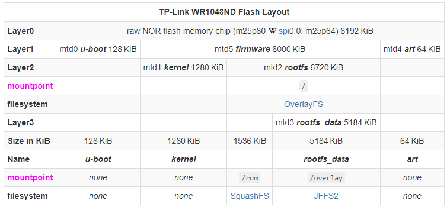

  > ### Explanations
  >
  > The Linux kernel treats “raw flash memory” (no matter whether NOR or NAND) chips as an [MTD (Memory Technology Device)](https://openwrt.org/docs/techref/mtd) and employs [filesystems](https://openwrt.org/docs/techref/filesystems) developed for this purpose on top of the MTD layer.
  >
  > Since the partitions are nested we look at this whole thing in layers:
  >
  > 1. Layer0: So we have the Flashchip, 8 MiB in size, which is soldered to the PCB and connected to the [soc](https://openwrt.org/docs/techref/hardware/soc) over [SPI (Serial Peripheral Interface Bus)](https://en.wikipedia.org/wiki/Serial Peripheral Interface Bus).
  > 2. Layer1: We “partition” the space into mtd0 for the bootloader, mtd5 for OpenWrt and, in this case, mtd4 for the ART (Atheros Radio Test) - it contains calibration data for the wifi (EEPROM). If it is missing or corrupt, `ath9k` (wireless driver) won't come up anymore. The bootloader (128 KiB) contains of the u-boot 64KiB block AND a data section which contains the MAC, WPS-PIN and type description. If no MAC is configured ath9k will not work correctly due to a faulty MAC.
  > 3. Layer2: we subdivide mtd5 (firmware) into mtd1 (kernel) and mtd2 (rootfs); In the generation process of the firmware (see [imagebuilder](https://openwrt.org/docs/guide-user/additional-software/imagebuilder)) the Kernel binary file is first packed with [LZMA](https://en.wikipedia.org/wiki/Lempel–Ziv–Markov chain algorithm), then the obtained file is packed with [gzip](https://en.wikipedia.org/wiki/gzip) and then this file will be written onto the raw flash (mtd1) without being part of any filesystem! During boot, u-boot copies this entire section into RAM and executes it. From there on, the Linux kernel bootstraps itself…
  > 4. Layer3: we subdivide rootfs even further into mtd3 for rootfs_data and the rest for an unnamed partition which will accommodate the SquashFS-partition.
  >
  > #### Mount Points
  >
  > - `/` this is your entire root filesystem, it comprises `/rom` and `/overlay`. Please ignore `/rom` and `/overlay` and use exclusively `/` for your daily routines!
  > - `/rom` contains all the basic files, like `busybox`, `dropbear` or `iptables`. It also includes default configuration files used when booting into [OpenWrt Failsafe mode](https://openwrt.org/docs/guide-user/troubleshooting/failsafe_and_factory_reset). It does not contain the Linux kernel. All files in this directory are located on the SqashFS partition, and thus cannot be altered or deleted. But, because we use overlay_fs filesystem, *overlay-whiteout*-symlinks can be created on the JFFS2 partition.
  > - `/overlay` is the writable part of the file system that gets merged with `/rom` to create a uniform `/`-tree. It contains anything that was written to the router after [installation](https://openwrt.org/docs/guide-user/installation/generic.flashing), e.g. changed configuration files, additional packages installed with `opkg`, etc. It is formated with JFFS2.
  >
  > Whenever the system is asked to look for an existing file in `/`, it first looks in `/overlay`, and if not there, then in `/rom`. In this way `/overlay` overrides `/rom` and creates the effect of a writable `/` while much of the content is safely and efficiently stored in the read-only `/rom`.

##### 实践

Windows下我使用了[Free Hex Editor: Fastest Binary File Editing Software. Freeware. Windows (hhdsoftware.com)](https://www.hhdsoftware.com/free-hex-editor)来查看二进制文件信息

1. 首先查看flash分区信息
   可以通过`cat /proc/mtd`来查看mtd分区，不过其中有些分区是重叠的。因此可以通过`dmsg`来查看系统的启动信息，找到其中的mtd信息，如下：

   ```bash
   [    0.615097] Creating 8 MTD partitions on "spi0.0":
   [    0.619893] 0x000000000000-0x000000030000 : "u-boot"
   [    0.626143] 0x000000030000-0x000000040000 : "u-boot-env"
   [    0.632722] 0x000000040000-0x000000050000 : "Bdata"
   [    0.638791] 0x000000050000-0x000000060000 : "factory"
   [    0.645206] 0x000000060000-0x000000070000 : "crash"
   [    0.651386] 0x000000070000-0x000000080000 : "cfg_bak"
   [    0.657804] 0x000000080000-0x000000180000 : "overlay"
   [    0.664113] 0x000000180000-0x000001000000 : "firmware"
   [    0.670710] 2 uimage-fw partitions found on MTD device firmware
   [    0.676656] Creating 2 MTD partitions on "firmware":
   [    0.681625] 0x000000000000-0x00000024d580 : "kernel"
   [    0.687745] 0x00000024d580-0x000000e80000 : "rootfs"
   [    0.693746] mtd: device 9 (rootfs) set to be root filesystem
   [    0.699502] 1 squashfs-split partitions found on MTD device rootfs
   [    0.705684] 0x000000d30000-0x000000e80000 : "rootfs_data"
   [    0.713298] libphy: Fixed MDIO Bus: probed
   [    0.743012] libphy: mdio: probed
   [    0.746455] mt7530 mdio-bus:1f: MT7530 adapts as multi-chip module
   [    0.755279] mtk_soc_eth 1e100000.ethernet: generated random MAC address aa:f9:37:65:6e:50
   [    0.764330] mtk_soc_eth 1e100000.ethernet eth0: mediatek frame engine at 0xbe100000, irq 21
   [    0.774735] mt7621-pci 1e140000.pcie: Parsing DT failed
   ```
   可和官方固件作对比（启动信息从openwrt对应设备页面获得）：
   ```bash
   [    2.280000] flash manufacture id: c8, device id 40 18
   [    2.280000] GD25Q128C(c8 40180000) (16384 Kbytes)
   [    2.280000] mtd .name = raspi, .size = 0x01000000 (16M) .erasesize = 0x00010000 (64K) .numeraseregions = 0
   [    2.280000] Creating 10 MTD partitions on "raspi":
   [    2.280000] 0x000000000000-0x000001000000 : "ALL"
   [    2.280000] 0x000000000000-0x000000030000 : "Bootloader"
   [    2.280000] 0x000000030000-0x000000040000 : "Config"
   [    2.280000] 0x000000040000-0x000000050000 : "Bdata"
   [    2.280000] 0x000000050000-0x000000060000 : "Factory"
   [    2.290000] 0x000000060000-0x000000070000 : "crash"
   [    2.290000] 0x000000070000-0x000000080000 : "cfg_bak"
   [    2.290000] 0x000000080000-0x000000180000 : "overlay"
   [    2.290000] 0x000000180000-0x000000e80000 : "OS1"
   [    2.290000] mtd: try split OS1 partition
   [    2.290000] mtd: split_firmware
   [    2.290000] mtd: firmware_partition->size   0xd00000
   [    2.290000] mtd: firmware_partition->offset 0x180000
   [    2.290000] mtd: uimage_len 1855601
   [    2.290000] mtd: uimage_len 1900544
   [    2.290000] mtd: rootfs_partition->size   0xb30000
   [    2.290000] mtd: rootfs_partition->offset 0x350000
   [    2.290000] mtd: partition "rootfs" created automatically, ofs=350000, len=B30000
   [    2.290000] 0x000000350000-0x000000e80000 : "rootfs"
   [    2.290000] 0x000000e80000-0x000001000000 : "disk"
   ```
2. 然后dump完整的flash（之前通过breed保存的EEPROM为eeprom.bin，完整flash为full.bin）
   ```
   cat /dev/mtd0 > dump.bin
   cat /dev/mtd1 >> dump.bin
   cat /dev/mtd2 >> dump.bin
   cat /dev/mtd3 >> dump.bin
   cat /dev/mtd4 >> dump.bin
   cat /dev/mtd5 >> dump.bin
   cat /dev/mtd6 >> dump.bin
   cat /dev/mtd7 >> dump.bin
   ```
3. 发现eeprom.bin的大小为64KB，刚好对应0x10000的大小。通过在full.bin中查找eeprom.bin内容，容易定位到Factory(0x50000)这个分区。发现Factory分区中即存储了EEPROM内容。
   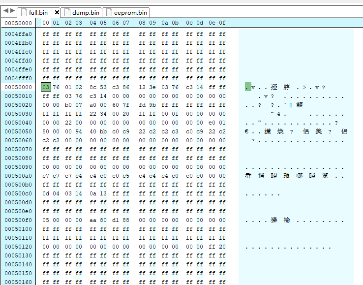

4. 然而openwrt直接dump下来的文件中，相同的内容，位置却定位到了Bdata(0x40000)这个分区
   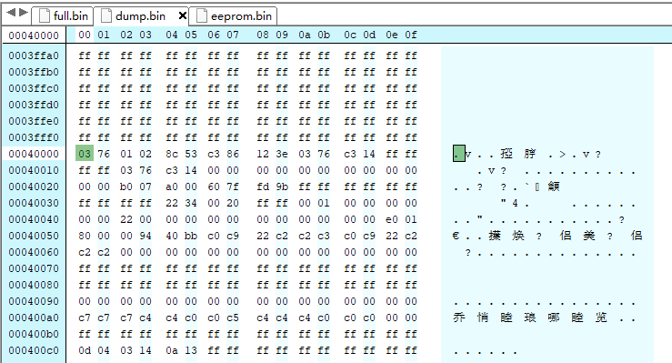
5. 对比其他分区，可以发现：
   - (0x00000-0x30000)Bootloader对应u-boot
     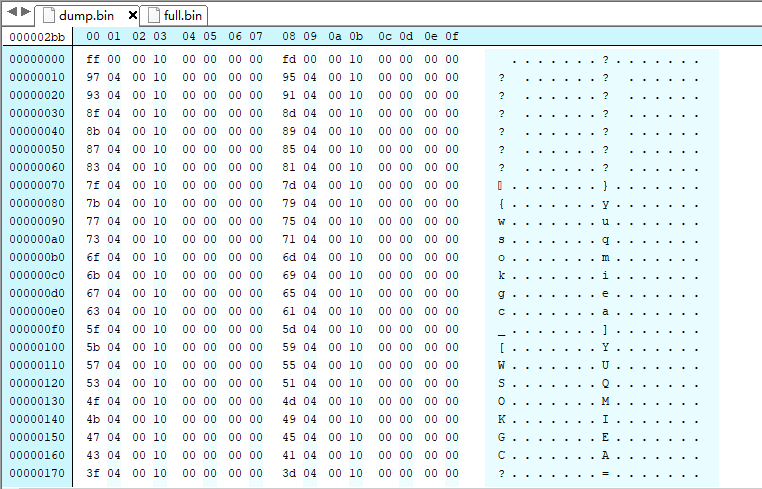
   - (0x30000-0x40000)Config对应u-boot-env
     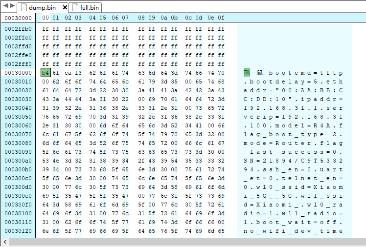
   - (0x80000-0x180000)overlay和overlay相对应
     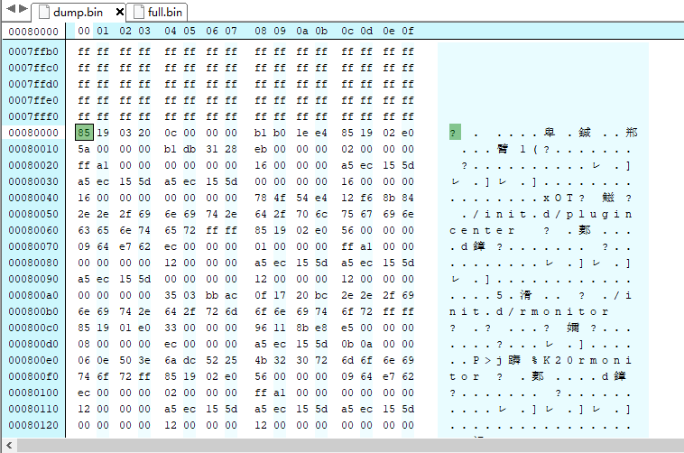
   - 中间的内容两边都不同，比较明显的是dump.bin中Bdata存储了Factory内容，而Factory的内容未知。
6. 因此考虑将eeprom.bin内容在openwrt中重新写入到Factory中
   然而直接mtd write会报以下错误
   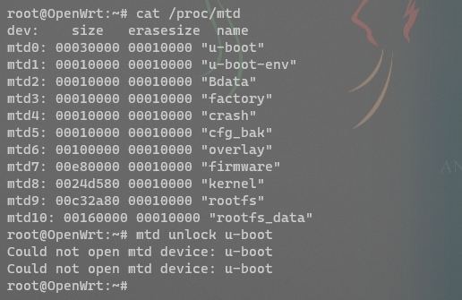
   搜索后发现需要安装内核模块`kmod-mtd-rw`，由于自己编译的内核hash值和官方版本不一致，于是我重新编译了openwrt镜像
   然后运行命令 I WANT A BRICK!!!
   ```bash
   insmod mtd-rw i_want_a_brick=1
   ```
   于是我们便可以愉快地解锁分区了，写入eeprom即可
```
mtd -r write eeprom.bin factory
```
1. 结束，写完后，我的5GHz 无线终于恢复正常了！

### 后记

虽然解决了问题，但其实还有一些疑问：
1. 使用breed无法成功刷breed。使用的breed有两个版本，看别人的教程说r3g和mi4a百兆版使用下面的版本，mi4a千兆版本使用上面的版本。
   
   然而使用breed时，可以看到，上面标的闪存布局0x50000并不对应OS1的地址，所以感觉不应该使用这个版本的breed！（所以上面发生的问题会不会是用错版本breed导致的？）breed上也没有说明是否支持mi4a[Index of / (hackpascal.net)](https://breed.hackpascal.net/)
   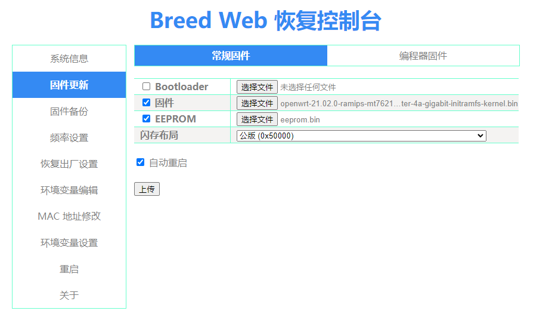
2. 印象中原本台式插上路由器测网速是能跑上1000M的，但是现在台式直插寝室网口下载速率可以跑到960M，而插上路由器却只有600M左右，感觉损失挺大的。不知是不是路由器还有潜在问题。（难道是block设置为512KB拖慢了速度？）
3. 可以看到路由分区中除了u-boot, u-boot-env, Factory, firmware，其他部分感觉都是没用的，这部分是否能利用起来？比如那个紧挨firmware的overlay分区感觉是没起作用的，但是占了1M的大小。crash和cfg_back也可以获得128KB的空间。

## 后记2

之前折腾vlan时，一不注意就导致无法访问到设备了。需要反复刷op，因此想使用breed来简化刷op过程。但其实breed官方根本没有对mi4a千兆版做支持，只是因为其flash分区和WR1200JS一样，所以网上都使用那个版本的breed，当时我觉得mi4a的硬件和r3g一摸一样，因此觉得刷r3g的应该也可以。结果刷完后就变砖了，官方恢复工具也无法恢复。后面才意识到上面的问题，breed的flash分区和openwrt的不一样。

过了半学期，我买了ch341a编程器，可以直接刷flash，因此可以把mi4a救回来了。但是发现之前备份的eeprom被我删了，然后使用编程器的时候，在意识到需要先备份时已经点了擦除。所以无奈只能在网上找了别人提供的eeprom。想到mi4a是我第一个openwrt的设备，我对它SLAAC的ipv6地址印象深刻（123d结尾），而现在没办法恢复了，不免有点感伤。

如果要用breed刷openwrt的话，需要修改op的flash分区：
- 这里提供了别人编译好的：[[20210919更新]小米路由4A千兆版LEDE固件_集成快乐上网、内网穿透、KMS、网络加速-小米无线路由器以及小米无线相关的设备-恩山无线论坛 - Powered by Discuz! (right.com.cn)](https://www.right.com.cn/forum/thread-4054821-1-1.html)
- 这里是如何自己修改：[分享小米R4A千兆版编译OPENWRT(Breed直刷版)-OPENWRT专版-恩山无线论坛 - Powered by Discuz! (right.com.cn)](https://www.right.com.cn/forum/thread-4052254-1-1.html)

但是想想还是算了，为什么要想办法去用一个官方不支持的东西呢？（造成这一切悲剧的源头）