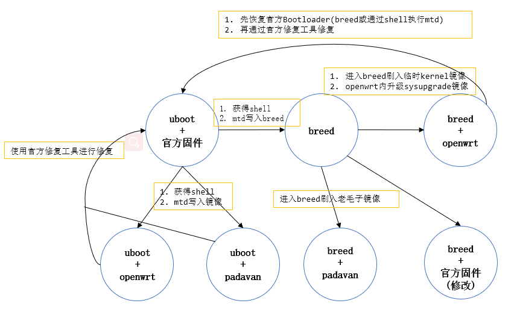

第一次尝试自己刷路由器，网上搜索了很多资料，忙活了 2 天，期间差点以为将路由器刷成砖了。

红米 AC2100 这款路由器确实算是很火，网上有很多资料。刚开始在恩山论坛查找各种资料，但是觉得恩山论坛的帖子有点乱，对新手不太友好。看精华帖时帖子之间的联系性不大，要是有一个板块进行总结性的介绍就好了。
<!-- more -->

比如上来就看到论坛说什么闪存坏块的，导致我刚开始还要去研究如何查看路由器是否有坏块。然后就是看到的都是什么 telnet 的方案，但是明明有通过网页开启 ssh 的非常简单的方案啊，为什么不在过时的帖子里提一下呢！这点导致我各种走弯路！（**这点也体现了总结性帖子的重要**）

然后就是为什么恩山里只提供各种 openwrt 的改版？就没有人站出来说一下官方版的优缺点吗？这一度让我以为 openwrt 的官方版不好不能用呢。但后面我看 openwrt 官网的时候，也没有发现什么缺点啊，而且 openwrt 官网文档非常丰富！是入门折腾路由器的绝佳材料。

好了，吐槽完毕，以下是我这段时间折腾的总结。

### 名词介绍

1. breed：一个多功能的**引导程序**，可以刷系统固件，适配了很多硬件，提供了方便的 web 界面和命令行界面。

   原帖：[【2020-10-09】AR/QCA/MTK Breed，功能强大的多线程 Bootloader - OPENWRT 专版 - 恩山无线论坛 - Powered by Discuz! (right.com.cn)](https://www.right.com.cn/forum/thread-161906-1-1.html)

   下载：[Index of / (hackpascal.net)](https://breed.hackpascal.net/)

### 直接上图

这张图显示了各种刷机的方式，具体过程在之后介绍。



### 获取 shell

方案来源者我没有找到，貌似都是最先在恩山论坛上提出的。

1. telnet 方案

   比较麻烦，不提。

2. ssh 方案

   - 原创：[[0825:AC2100 新固件有效 AX6 无效\]AX3600/AX1800/AX5/AC2100官方固件开启SSH方法[原创] - 小米无线路由器以及小米无线相关的设备 - 恩山无线论坛 - Powered by Discuz! (right.com.cn)](https://www.right.com.cn/forum/thread-4032490-1-1.html)

   - openwrt wiki 教程中，提供了一个 JavaScript 脚本可直接在浏览器控制台运行，不必手动复制 Stock 代码。[[OpenWrt Wiki\] Xiaomi Redmi Router AC2100](https://openwrt.org/toh/xiaomi/xiaomi_redmi_router_ac2100)

   有的帖子说有漏洞的官方固件版本是 2.0.7 版本，但我实测 2.0.23 版本 (2021-06-22 时的最新版) 是可以用的，openwrt wiki 上也要求 2.0.23 版本。

### 从官方刷 openwrt

```
mtd write openwrt-ramips-mt7621-xiaomi_redmi-router-ac2100-squashfs-kernel1.bin kernel1
mtd -r write openwrt-ramips-mt7621-xiaomi_redmi-router-ac2100-squashfs-rootfs0.bin rootfs0 #-r参数表示完成后重启
```

kernel 按照原厂 bootloader 所要求的方式添加到镜像中，因此可以保留原厂的 bootloader（见[[OpenWrt Wiki\] Overview](https://openwrt.org/docs/guide-developer/overview)）

（说明路由器这种设备，引导程序和操作系统是绑定在一起的）

> Also the kernel is handled like a package, but is added to the firmware image in the special way each device's bootloader expects it, so you can replace the stock firmware without touching the bootloader itself (that is dangerous and not always possible).

### 刷 breed

[红米/小米 AC2100 刷入 r3g breed 以及恢复官方 boot 详细教程（更新查坏块方法、pb-boot） - 小米无线路由器以及小米无线相关的设备 - 恩山无线论坛 - Powered by Discuz! (right.com.cn)](https://www.right.com.cn/forum/thread-4023907-1-1.html)

1. 进入 shell 后，`cat /proc/mtd`查看 flash 分区
2. 上传 breed 并运行`mtd -r write /tmp/breed-mt7621-xiaomi-r3g.bin Bootloader`

### 从 breed 刷 openwrt

[[2020-08-29 更新\] 教程：小米和红米 AC2100 用 breed 刷 openwrt - 小米无线路由器以及小米无线相关的设备 - 恩山无线论坛 - Powered by Discuz! (right.com.cn)](https://www.right.com.cn/forum/thread-4025861-1-1.html)

1. 进 breed 的环境变量编缉菜单，新增字段 xiaomi.r3g.bootfw 值为 2
2. 下载临时固件刷入路由器并重启
3. 进入 openwrt 更新系统固件，不要勾选 保留配置选项

### 恢复到官方

1. 恢复官方 Bootloader

   - 通过 breed 更新 Bootloader
   - 进入 shell 执行 mtd write 命令

2. 使用官方修复工具

   [【小米路由器修复工具】使用说明和刷机教程 - 小米社区 (xiaomi.cn)](https://www.xiaomi.cn/post/5289432)

记录：

首先使用 breed 直接刷了小米官方 bootloader（有些地方说不行，最好手动使用 mtd write 命令），然后使用官方修复工具恢复官方固件

坑：

- 运行官方修复工具需要关闭 windows 即时杀毒
- 最好禁用一些网卡免得选择错误
- 失败了三四次，换用不同地方下载的官方固件最后解决了（最后用的本目录的 2.0.23.bin）
- 实测写官方固件不到 1 分钟，不必等太长

#### 其它方式

适用于 breed 的修改版官方固件

[[2020 年 11 月 28 日更新\]breed 刷机红米 AC2100 小米 AC2100 原厂固件官方固件 - 小米无线路由器以及小米无线相关的设备 - 恩山无线论坛 - Powered by Discuz! (right.com.cn)](https://www.right.com.cn/FORUM/thread-4028850-1-1.html)


### 其它参考

恩山的这个帖子适合小白：[红米 (小米)AC2100 无需 Telnet 刷入 Breed 和 Padavan 固件教程 - 小米无线路由器以及小米无线相关的设备 - 恩山无线论坛 - Powered by Discuz! (right.com.cn)](https://www.right.com.cn/forum/thread-4054150-1-1.html)