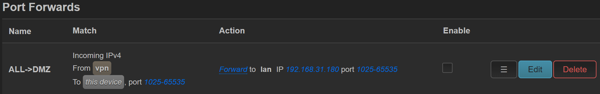

### 实验室网络风波

6 月 21 号下午 5 点左右实验室断网了 (现象是 ping 百度延迟 5,6 秒），然后来的维修人员说网口上不允许插路由器。然后我便把路由器断了。经过一两小时后网络才恢复。我期间问了 fjw，觉得没有不让用路由器这个说法。晚上便将路由器插回去了，网络没出啥问题。
6 月 23 号上午 11 点，实验室又断网了。czw 把我路由器拔了。我觉得如果拔掉期间网络还出问题，也能说明不是路由器的原因。但是到 6 月 30 号网络还没有出问题（期间我在补课程综述，完全没访问台式机，所以无感）。所以验证计划失败。不过整个过程中，小黄的路由器是一直插在网口上面的，但是好像没有登录校园网账号，所以也不能说明问题。

<!-- more -->

### 解决

没办法，我 6/30 去实验室打算恢复我的台式机访问能力。想了几种方案

- 到实验室时使用台式机登录校园网账号，回寝室再重新登录校园网。这种方式不仅麻烦，而且还有其它问题：
  - 无法两台设备上网：现在实验室我有两台设备（台式和笔记本），笔记本连 ustcnet 得登校园网，台式机连有线也得登校园网。
  - 没法共用键鼠：我笔记本和台式通过 barrier 共用键鼠，现在没办法通过局域网地址连接了。
  - 回寝室没法访问台式：虽然原本 openwrt 路由器 WAN 口 dhcp 得到的 ipv6 地址是不变的地址，是通过 MAC+FFE0 生成，但是台式 ubuntu 得到的 ipv6 却总是在变。所以回了寝室后，台式机没法使用域名（没网去更新 ddns）也没法通过 ip 访问
- 台式机和轻薄本都通过 wireguard，连接到寝室路由器上网。这样子确实还能用，但是还是有问题
  - barrier 可以使用 wireguard 配置的私有地址访问，但是这样需要我寝室路由器转发，有时会明显卡顿。
  - 使用 wireguard 没法使用 ipv6 上网了（我不清楚 wireguard 怎么配置）
  - 回寝室访问台式机只能使用 wireguard 的私有地址。我在台式机上配置了如 SMB 等服务，我的笔记本、平板，使用时都得打开 wireguard，远没有之前连上任意路由器就能使用的顺畅感。
  - 之前软件里配置的 ip 都得重新配置

我本来是想把路由器拿掉，直到实验室网络再出问题的（有点赌气）。但是突然想到，既然限制是不登校园网账号，那我让实验室的路由器通过 vpn 连到我寝室的路由器上网不就行了？我之前是让寝室的路由器走实验室的路由器，现在只要简单反过来就好了。改动之后和我之前的网络环境完全没有区别。

### 小问题

但是此时遇到了个小问题，台式机虽然能访问 b 站，但是突然无法科学上网了。clash 测速显示超时。我试了 ping 梯子服务器域名是可以 ping 通的，但是 curl 使用代理访问谷歌会返回 502 错误。

```
➜  clash curl -v http://google.com
* Uses proxy env variable no_proxy == 'localhost,127.0.0.0/8,::1'
* Uses proxy env variable http_proxy == 'http://localhost:11223/'
*   Trying 127.0.0.1:11223...
* Connected to localhost (127.0.0.1) port 11223 (#0)
> GET http://google.com/ HTTP/1.1
> Host: google.com
> User-Agent: curl/7.81.0
> Accept: */*
> Proxy-Connection: Keep-Alive
> 
* Mark bundle as not supporting multiuse
< HTTP/1.1 502 Bad Gateway
< Connection: keep-alive
< Keep-Alive: timeout=4
< Proxy-Connection: keep-alive
< Content-Length: 0
< 
* Connection #0 to host localhost left intact
```

最后发现是我的防火墙配置的 DMZ 的问题。为了联机怪猎，我之前尝试让寝室的笔记本能够处于 Full Cone NAT 类型中（openwrt 默认是 symmetric NAT），找到的方法是添加这样的配置



- 基本的规则是 wan->this device，但是我的路由器通过 vpn 转发给另一个路由器上网，所以这里是 vpn->this device，同时另一台路由器上还得配置

  

但是此次我将上网方式调换了，所以上面的规则就有问题了。将上面的转发去掉后，网络恢复了正常。